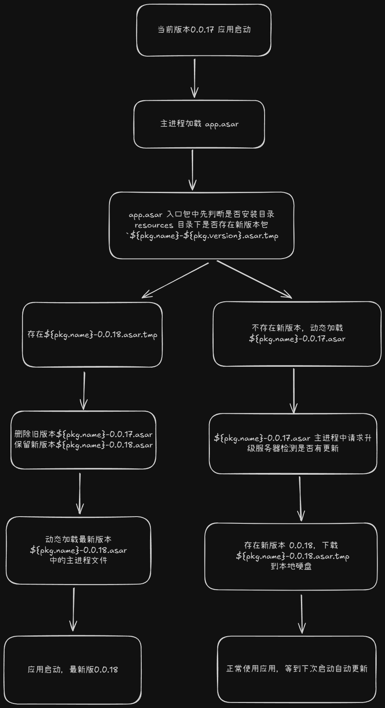
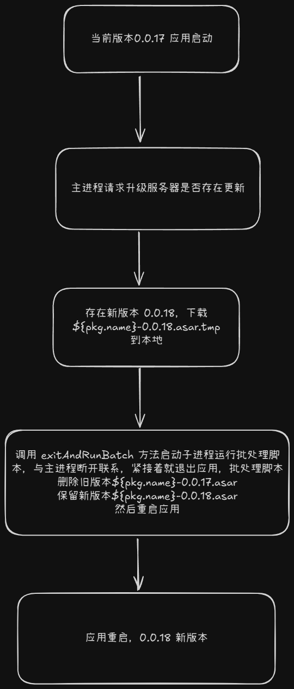

# asar 增量更新

通过观察发现 `electron-builder` 和 `electron-updater` 实现的差分更新，并不能节省多少下载的带宽，这时候就需要实现只更新 `asar` 包的增量更新，1 包的体积小，更能节省带宽，提升更新的速度，用户体验好。

## 两种方案

- 不管是哪种方案，`asar` 更新的本质都是
  1. 下载新版本的 `asar` 包
  2. 关闭软件之后用新版本包覆盖旧版本包
  3. 重启软件更新完成
- 所以两种方案的区别就在于关闭软件之后覆盖文件的方式不同，因为软件正在运行的途中，`asar` 包处于锁定状态，是无法覆盖的，所以就是为了解决覆盖文件的问题
  1. 第一种是双 `asar` 包方案，软件会生成两个 `asar` 包，`electron-builder` 默认打包生成的 `app.asar` 作为入口包，软件启动后还是从 `app.asar` 启动，但是 `app.asar` 的代码里只存放检测新版本文件和覆盖的逻辑，做完覆盖操作后就使用 `require` 或者 `import` 动态导入 `main-v1.0.0.asar` 这个主 `asar` 包，所有软件的业务逻辑都在主包中
  2. 第二种逻辑简单一些，检查升级服务器是否存在新版本包，如果存在就下载下来，下载成功后立即退出软件，同时启动一个子进程，与软件主进程脱离关系，主进程退出后执行一个批处理脚本（或者 shell 脚本）覆盖操作，覆盖成功后再重启软件。所有的覆盖逻辑还有重启逻辑都在批处理脚本中
- 优缺点分析：

  - 双 `asar` 方案缺点是会出现两个版本号，因为 `asar` 包中必须存在 `package.json` 文件，因此当主包升级后，主包版本号会和入口包版本号不一致，解决办法是实现一个方法，需要读取版本号的时候都要去读取主包内的 `package.json` 的版本号。双包方案实现起来略微有些复杂
  - 批处理脚本的优点是，实现起来简单，缺点是有可能批处理脚本的操作会被杀毒软件认为是病毒操作，被误杀

## 双 asar 方案



```js
// 主包入口文件 index.js
const path = require('node:path');
const { app, dialog } = require('electron');
const log = require('./logger');
const fs = require('node:fs');
const { getMajorPackageInfo, findAsarFilesInResources } = require('./utils.js');

try {
  // 如果是生产包，就去扫描软件安装目录 resources 目录下是否存在多个 asar 包，如果存在说明新版本已经下载到本地了，判断哪个 asar 包是最新版本，然后进行文件替换操作完成升级
  // 新版本包下载下来是带 .tmp 后缀的 main-v1.0.0.asar.tmp 以便和旧版本区分
  if (app.isPackaged) {
    const asarFiles = findAsarFilesInResources();
    log.info(asarFiles, 'asarFiles');
    if (asarFiles.length > 1) {
      const tmp = asarFiles.filter(i => i.includes('.tmp'))[0];
      const old = asarFiles.filter(i => !i.includes('.tmp'))[0];
      log.info(`tmp: ${tmp} old: ${old}`);
      if (tmp && old) {
        try {
          fs.renameSync(tmp, tmp.replace('.tmp', ''));
          fs.unlinkSync(old);
          log.info('update main asar successful');
        } catch (err) {
          log.error(`fs.renameSync err: ${err}`);
        }
      }
    }
  }

  let mainAppPath;
  // 本地 dev 开发环境直接加载 main.js 主逻辑文件
  if (!app.isPackaged) {
    mainAppPath = path.join(app.getAppPath(), 'main', 'main.js');
  } else {
    // 生产环境动态加载主 asar 包中的 main.js
    const asarFiles = findAsarFilesInResources();
    const mainAsar = asarFiles[0];
    const pkg = getMajorPackageInfo(mainAsar);
    log.info(pkg, 'pkg');
    const resourcesPath = path.dirname(app.getAppPath());
    mainAppPath = path.join(
      resourcesPath,
      `${pkg.name}-${pkg.version}.asar`,
      'main.js'
    );
  }

  log.info('Loading main application from:', mainAppPath);
  // 动态加载
  const mainModule = require(mainAppPath);
  mainModule(log);
} catch (error) {
  log.error('Failed to load main application:', error);

  dialog.showErrorBox(
    '应用加载失败',
    `无法加载主应用模块: ${error.message}\n请尝试重新安装应用`
  );

  app.quit();
}

// 获取主包版本号
exports.getMajorPackageInfo = function getMajorPackageInfo(mainAsarPath) {
  try {
    let pkgPath;

    if (!app.isPackaged) {
      pkgPath = path.join(__dirname, './package.json');
    } else {
      pkgPath = path.join(mainAsarPath, 'package.json');
    }

    const pkgContent = fs.readFileSync(pkgPath, 'utf8');
    return JSON.parse(pkgContent);
  } catch (error) {
    log.error('read package.json failed:', error);
    return {
      name: 'unknown-app',
      version: '0.0.0',
    };
  }
};

// 获取 resources 目录下多个 asar 主包
exports.findAsarFilesInResources = function findAsarFilesInResources() {
  try {
    const resourcesPath = path.dirname(app.getAppPath());
    log.log('resources dir path:', resourcesPath);

    const files = fs.readdirSync(resourcesPath, { withFileTypes: true });

    const asarFiles = files
      .filter(
        item =>
          !item.isDirectory() &&
          item.name.includes('asar') &&
          item.name !== 'app.asar'
      )
      .map(item => path.join(resourcesPath, item.name));

    log.log(`find ${asarFiles.length} files includes asar:`);
    asarFiles.forEach(file => log.log(`- ${file}`));

    return asarFiles;
  } catch (error) {
    log.error('get asar files list failed:', error.message);
    return [];
  }
};
```

下面是主包逻辑 main.js，导出一个函数，函数中就是所有主逻辑

```js
module.exports = async function () {};
```

然后是 `electron-builder` 打包配置，在 `package.json` 中设置 `extraResources` 复制主进程文件到 `${name}-${version}.asarfolder` 目录下，并且设置 `afterPack` 脚本去处理 pack 之后的第二个 asar 包的生成

```js
{
      "extraResources": [
      {
        "from": "main",
        "to": "${name}-${version}.asarfolder",
        "filter": [
          "**/*"
        ]
      }
    ],
    "afterPack": "./afterPack.js"
}
```

下面是 `afterPack.js`，解压 `app.asar` 从中获取到 `node_modules` 和 `package.json` 复制到 `${name}-${version}.asarfolder` 下，然后再将 `${name}-${version}.asarfolder` 打成 `${pkg.name}-${pkg.version}.asar` 文件，即第二个 asar 包

```js
const localPgk = require('local-pkg');
const asar = require('@electron/asar');
const path = require('path');
const fs = require('fs-extra');

module.exports = async context => {
  async function moveToDirectory(source, targetDir) {
    try {
      if (!(await fs.pathExists(source))) {
        throw new Error(`moveToDirectory source doesn't exist: ${source}`);
      }

      const sourceName = path.basename(source);
      const targetPath = path.join(targetDir, sourceName);

      // ensure targetDir exists,if doesn't then creat
      await fs.ensureDir(targetDir);

      // check targetDir exists same source, if exists remove
      if (await fs.pathExists(targetPath)) {
        await fs.remove(targetPath);
        console.log(
          `  • moveToDirectory already remove same source in targetDir: ${targetPath}`
        );
      }

      await fs.move(source, targetPath);
      console.log(`  • moveToDirectory move successful: ${targetPath}`);
    } catch (error) {
      console.error('  • moveToDirectory move failed:', error.message);
      throw error;
    }
  }

  async function extractAsarFile(from, dest) {
    try {
      await fs.ensureDir(dest);

      console.log(`  • start extract asar: ${from}`);
      console.log(`  • extract to dest: ${dest}`);

      await asar.extractAll(from, dest);

      console.log('  • asar extract complete');
      return true;
    } catch (error) {
      console.error('  • asar extract error:', error);
      throw error;
    }
  }

  const pkg = localPgk.loadPackageJSONSync();

  const from = path.join(__dirname, './dist/win-unpacked/resources/app.asar');
  const dest = path.join(__dirname, './dist/win-unpacked/resources/temp');
  const target = path.join(
    __dirname,
    `./dist/win-unpacked/resources/${pkg.name}-${pkg.version}.asarfolder/`
  );

  try {
    // extract app.asar to temp folder
    await extractAsarFile(from, dest);
    console.log('  • extract app.asar complete');

    const nodeModulesPath = path.join(
      __dirname,
      './dist/win-unpacked/resources/temp/node_modules'
    );
    const pkgPath = path.join(
      __dirname,
      './dist/win-unpacked/resources/temp/package.json'
    );

    // copy mode_modules and package.json to main asar folder
    await moveToDirectory(nodeModulesPath, target);
    await moveToDirectory(pkgPath, target);

    // remove temp
    await fs.remove(dest);
    console.log('  • remove temp file complete');

    const asarFolder = path.join(
      __dirname,
      `./dist/win-unpacked/resources/${pkg.name}-${pkg.version}.asarfolder`
    );
    const asarDest = path.join(
      __dirname,
      `./dist/win-unpacked/resources/${pkg.name}-${pkg.version}.asar`
    );

    // pack asar folder
    await asar.createPackage(asarFolder, asarDest);

    console.log('  • asar pack complete');

    // remove original asar folder
    await fs.remove(asarFolder);

    console.log('  • remove asar temp folder complete');
  } catch (err) {
    throw err;
  }
};
```

最后是检查是否需要增量更新的方法，请求服务器最新的版本号和 resources 目录下的 asar 主包中 package.json 中的版本号对比判断是否需要更新

```js
exports.asarUpdateCheck = async function asarUpdateCheck(sendStatusToWindow) {
  const log = global.log;
  const res = await axios.get('http://127.0.0.1:33855/update.json');
  log.info(res.data, 'update.json res');

  const latest = res.data[0];
  log.info(latest, 'latest');

  const asarFiles = findAsarFilesInResources();
  let currentVersion;
  if (asarFiles.length === 1) {
    const pkg = getMajorPackageInfo(asarFiles[0]);
    currentVersion = pkg.version;
  } else if (asarFiles.length > 1) {
    const versionArr = asarFiles.map(i => getMajorPackageInfo(i).version);
    versionArr.sort((a, b) => compareVersion(a, b));
    currentVersion = versionArr[versionArr.length - 1];
  } else {
    app.quit();
  }
  log.info(
    `currentVersion: ${currentVersion} latest.version: ${latest.version}`
  );

  const compareRes = compareVersion(latest.version, currentVersion);
  if (compareRes === 1) {
    sendStatusToWindow('New Version found.');
    if (latest.type === 'full') {
      return 'full';
    } else {
      // check if there is on full between latest and current, then will be full update not asar
      const currentIndex = res.data.findIndex(
        i => i.version === currentVersion
      );
      log.info('currentIndex', currentIndex);
      const filterData = res.data.slice(1, currentIndex);
      log.info('filterData', filterData);
      log.info(
        `filterData.some((i) => i.type === 'full')`,
        filterData.some(i => i.type === 'full')
      );
      if (filterData.some(i => i.type === 'full')) {
        return 'full';
      }
      log.info(`start download asar update ${latest.name}`);
      const targetDir = app.isPackaged
        ? path.join(path.dirname(app.getAppPath()))
        : path.join(app.getAppPath());
      await downloadAsarFile(
        `http://127.0.0.1:33855/${latest.name}`,
        targetDir,
        () => {},
        true,
        sendStatusToWindow
      );
    }
    return 'asar';
  } else {
    sendStatusToWindow('update not available.');
    return false;
  }
};
```

## 批处理方案



批处理方案的逻辑就简单得多了，首先检查更新和下载 asar 增量包得逻辑和双包方案是一样的，在确定需要增量更新后，调用 `exitAndRunBatch` 方法退出应用并升级

```js
export function exitAndRunBatch(newAsarPath: string) {
  const log = global.log;
  try {
    const exePath = process.execPath;
    const resourcesPath = path.dirname(app.getAppPath());
    const appAsarPath = path.join(resourcesPath, 'app.asar');
    const batPath = path.join(resourcesPath, 'update.bat');

    log.info(
      `resourcesPath: ${resourcesPath}, newAsarPath: ${newAsarPath}, appAsarPath: ${appAsarPath}, exePath: ${exePath}`
    );

    const batContent =
      '@echo off\r\n' +
      'chcp 936 >nul 2>&1\r\n' +
      '\r\n' +
      ':: wait 3 seconds ensure main process exit\r\n' +
      'timeout /t 3 /nobreak >nul\r\n' +
      '\r\n' +
      ':: loop wait asar file unlock\r\n' +
      'if exist "' +
      appAsarPath +
      '" (\r\n' +
      '    :WAIT_DELETE\r\n' +
      '    del "' +
      appAsarPath +
      '" >nul 2>&1\r\n' +
      '    if %errorlevel% equ 0 (\r\n' +
      '        goto DELETE_SUCCESS\r\n' +
      '    ) else (\r\n' +
      '        timeout /t 1 /nobreak >nul\r\n' +
      '        goto WAIT_DELETE\r\n' +
      '    )\r\n' +
      ')\r\n' +
      ':DELETE_SUCCESS\r\n' +
      '\r\n' +
      ':: move new file\r\n' +
      'move "' +
      newAsarPath +
      '" "' +
      appAsarPath +
      '"\r\n' +
      '\r\n' +
      ':: relaunch app\r\n' +
      'start "" "' +
      exePath +
      '"\r\n' +
      '\r\n' +
      ':: delete bat script self\r\n' +
      'del "%~f0" >nul 2>&1\r\n';

    const buffer = iconv.encode(batContent, 'gbk');
    fs.writeFileSync(batPath, buffer);

    const out = fs.openSync(path.join(resourcesPath, './out.log'), 'a');
    const err = fs.openSync(path.join(resourcesPath, './out.log'), 'a');

    const child = spawn(batPath, [], {
      cwd: resourcesPath,
      detached: true,
      shell: true,
      stdio: ['ignore', out, err],
      windowsHide: true,
    });
    child.on('spawn', () => {
      log.info('child process start successful');
      app.quit();
    });
    child.on('error', err => {
      logErrorInfo('child process on error', err);
    });
    child.unref();

    return true;
  } catch (err) {
    logErrorInfo('bat script run failed error: ', err);
    return false;
  }
}
```

- 这里需要注意的是，在 windows 下，文本的换行符是 `\r\n` 所以需要拼接换行符字符串，否则子进程执行批处理脚本会失败，然后 windows 下字符编码多是 'gbk' 编码，需要转换成 `gbk` 编码，否则一旦路径中出现中文字符，脚本也会失败，最后通过子进程的 `spawn` 的参数 `detached` 设置为 `true`，使得子进程与父进程分离开独立运行（父进程退出不会导致子进程也退出），`shell`设置为 `true`，因为在 `shell` 中运行脚本才能支持很多丰富的语法，`windowsHide` 隐藏子进程打开的命令行窗口，stdio 设置子进程的输入，输出，和错误信息组成的数组，忽略掉输入，将子进程的输出和错误信息写入本地硬盘文件，方便调试。最后调用 `child.unref()`，通常父进程会等待子进程退出，调用 `child.unref()` 后父进程不再等待子进程，会提前退出

- 这里需要注意，项目路径或者说批处理文件的路径中不要有特殊符号，比如括号之类的符号，否则子进程 spawn 方法也会调用失败

## 参考链接

- [child_process.spawn(command[, args][, options])](https://nodejs.org/docs/latest/api/child_process.html#child_processspawncommand-args-options)
- [subprocess.unref()](https://nodejs.org/docs/latest/api/child_process.html#subprocessunref)
