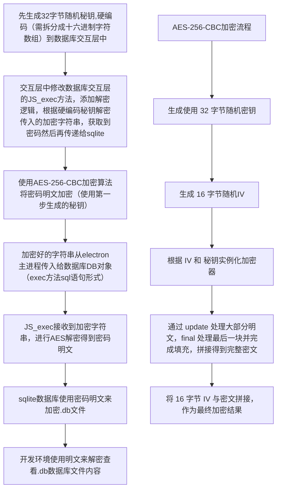

# 数据库加密

- 数据库中如果存储敏感数据，不希望数据被窃取，则需要对数据库文件加密。这里想到的方案是修改 `better-sqlite3-multiple-ciphers` 的源码，编译自定义的 sqlite3 数据库以支持 AES 解密流程
  - 拉取 `better-sqlite3-multiple-ciphers` 源码
  - 生成 AES 秘钥（32字节，64位十六进制字符串），然后将其转换成字节数组，硬编码到数据库源码 C++ 代码中
  - 修改数据库源码 `JS_exec` 方法，此方法用于执行 sql 语句，增加劫持 `PRAGMA key='xxx'` 和 `PRAGMA rekey='xxx'` 的逻辑，使用之前硬编码的秘钥将 key 和 rekey 解密，得到密码原文，然后再传递给 sqlite 作为 db 文件的密码
  - 编译修改好的数据库生成 .node 原生模块，之后使用时 `this.db.exec("PRAGMA key='xxx'")` exec 传递的 PRAGMA 语句都会被劫持然后走解密流程，可以使用 `SQLiteStudio` 软件打开加密的数据库，选择数据库类型为 `WxSQLite3`，密码类型为 `sqleet: ChaCha20-Poly1305`，然后输入明文密码即可打开数据库文件

## 参考链接

- [better-sqlite3-multiple-ciphers](https://www.npmjs.com/package/better-sqlite3-multiple-ciphers)