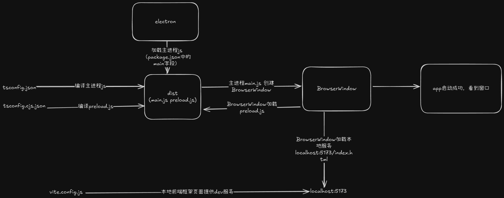

# 开发框架搭建

- 现在来搭建一个本地开发框架，要分两种情况
  - 第一种，主进程使用 esm 模块和 typescript，package.json 设置 `"type": "module"`，运行或者打包的时候还是将主进程代码编译成 esm 模块
  - 第二章，主进程依然使用 esm 模块，但是 package.json 设置 `"type": "commonjs"`，运行打包时编译成 commonjs 模块
- 这样分开的原因：

  - [electron v28.0.0](https://github.com/electron/electron/releases/tag/v28.0.0) 版本开始才全面支持 esm 模块，也就是之前的版本主进程代码都使用 commonjs 模块，而最后一个支持 windows7 系统的版本是 `electron v22`，如果还需要开发支持 win7 的应用，那就只能用 commonjs 模块来写主进程代码了。

  ```
    Electron will be ending support for Windows 7/8/8.1 after version 22.x.y following Chromium's plan to end support. Older versions of Electron will continue to work, but no further updates will be made for these operating systems.
  ```

  - 虽然官方说 v22 是最后一个支持 win7 的版本，但是看到有人测试发帖说 v22 在 win7 运行会报错，所以兼容 win7 需要使用 v21.4.4 版本，v21 的最后一个版本

  

## esm 模块

- 设置 ts 配置，这个设置作为编译主进程代码时的配置，而 preload.js 建议还使用 commonjs 所有创建第二个 ts 配置用于编译 preload.js

```js
// tsconfig.json 或取名 tsconfig.es.json 编译主进程代码
{
  "compilerOptions": {
    "target": "esnext",
    "module": "esnext",
    "moduleResolution": "node",
    "strict": true,
    "sourceMap": true,
    "resolveJsonModule": true,
    "isolatedModules": true,
    "esModuleInterop": true,
    "lib": ["ESNext", "DOM"],
    "outDir": "dist",
    "rootDir": "src/main",
    "typeRoots": [
      "./node_modules/@types",
      "./node_modules/**/*.d.ts",
      "./src/main/types"
    ],
    "types": ["node", "electron"],
    "skipLibCheck": true,
    "allowUmdGlobalAccess": true,
    "allowSyntheticDefaultImports": true,
    "forceConsistentCasingInFileNames": true,
  },
  "include": ["./src/main/**/*", "./src/main/types/global.d.ts"],
  "exclude": [
    "node_modules",
    "dist",
    "src/main/renderer/*",
    "src/main/preload.ts"
  ]
}

// tsconfig.cjs.json 编译 preload.js

{
  "compilerOptions": {
    "allowJs": true,
    "outDir": "./dist",
    "module": "CommonJS",
    "target": "ES6",
    "moduleResolution": "Node",
    "rootDir": "./src/main",
    "esModuleInterop": true,
    "skipLibCheck": true
  },
  "include": ["./src/main/preload.ts"],
  "exclude": ["node_modules", "dist"]
}

```

- 然后再处理渲染进程页面的问题，demo 中简单使用原生 html，只需要将页面相关文件复制到最终 dist 目录即可完成编译，最后我们的 npm scripts

```js
{
    "scripts": {
    "dev:ts": "tsc -p tsconfig.json", // 编译主进程 js
    "dev:cjs": "tsc -p tsconfig.cjs.json", // 编译 preload.js
    "dev:copy": "copyfiles -u 2 ./src/renderer/* ./dist", // 复制渲染进程页面到 dist
    "dev:watch": "nodemon --watch ./src --ext ts,js,html,css --exec \"npm run dev\"", // 监测代码变化重新编译启动
    "dev": "npm run clean && npm run dev:cjs && npm run dev:ts &&  npm run dev:copy && electron .", // 启动本地dev环境
    "clean": "rimraf ./dist",
  },
}

```

- 这样编译出来的所有文件都在 dist 目录下，所以主进程寻找 `preload.js` 和 `html` 文件的时候就很方便，都基于当前模块的路径就能找到

```js
const win = new BrowserWindow({
  width: 800,
  height: 600,
  webPreferences: {
    preload: path.join(__dirname, 'preload.js'),
  },
});
global.win = win;

const html = path.join(__dirname, 'index.html');
```

- 如果渲染进程页面使用了其他前端框架，例如 vue react svelte 等，dev 环境就不需要复制 html 相关文件到 dist 目录了，只需要主进程窗口加载页面时区分 dev 和 prod 就行了

```js
const win = new BrowserWindow({
  show: false,
  frame: false,
  webPreferences: {
    webSecurity: false,
    nodeIntegration: true,
    preload: path.join(__dirname, 'preload.js'),
  },
});

if (app.isPackaged) {
  // 判断打包后的环境，加载编译目录的文件，app.getAppPath() 获取当前应用程序的目录，获取到的目录就是 `你的安装目录/resources/app.asar`
  const filePath = path.join(app.getAppPath(), 'maindist/index.html');
  win
    .loadFile(filePath)
    .then(() => {
      log.info('win.lodaFile successful');
    })
    .catch(err => {
      logErrorInfo('win.lodaFile failed', err);
    });
} else {
  // dev开发环境直接加载前端框架(vue react svelte)的本地 dev 服务器提供的页面
  win.loadURL('http://localhost:5173/login');
}
```

## commonjs 模块兼容 win7

## 参考链接

- [ES Modules (ESM) in Electron](https://www.electronjs.org/docs/latest/tutorial/esm)
- [feat: I guess it's esm #37535](https://github.com/electron/electron/pull/37535)
- [electron v28.0.0](https://github.com/electron/electron/releases/tag/v28.0.0)
- [electron v22.0.0](https://github.com/electron/electron/releases/tag/v22.0.0)
