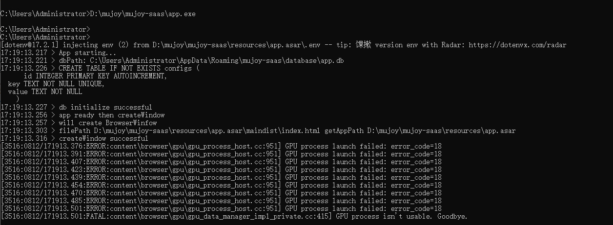

# electron 开发踩坑

## electron 应用的一些重要路径

- 默认安装目录 `C:\Users\用户名\AppData\Local\Programs\应用名`
- electron-builder 打包时需要用到的 electron 包会下载到 `C:\Users\用户名\AppData\Local\electron\Cache`
- electron-builder 打包时需要用到的 nsis 和 winCodeSign 在 `C:\Users\用户名\AppData\Local\electron-builder\Cache`
- electron-updater 更新时下载的全量安装包会下载到 `C:\Users\用户名\AppData\Local\应用名-updater`
- 默认日志或者缓存目录 （使用 app.getPath('userData')） `C:\Users\用户名\AppData\Roaming\应用名`

## electron-builder 打包下载相关

- electron-builder 打包的时候会根据目标平台和软件位宽去下载对应平台和版本的 electron 包，下载后 windows 系统下放在 `C:/Users/用户名/AppData/Local/electron/Cache` 目录下
- 如果一直下载失败，可以去 [registry.npmmirror.electron](https://registry.npmmirror.com/binary.html?path=electron/)手动下载对应版本然后放到 `C:/Users/用户名/AppData/Local/electron/Cache`目录下
- 还需要 winCodeSign 签名工具, 在 [electron-builder-binaries/winCodeSign-2.4.0](https://github.com/electron-userland/electron-builder-binaries/releases/tag/winCodeSign-2.4.0) 下载后放在 `C:\Users\用户名\AppData\Local\electron-builder\Cache\winCodeSign\winCodeSign-2.6.0`
- 还需要 nsis，在 [electron-builder-binaries/nsis-3.0.3.2](https://github.com/electron-userland/electron-builder-binaries/releases/tag/nsis-3.0.3.2) 下载，然后放在 `C:\Users\用户名\AppData\Local\electron-builder\Cache\nsis\nsis-3.0.4.1`
- 还需要 nsis-resources, 在 [electron-builder-binaries/nsis-resources-3.4.1](https://github.com/electron-userland/electron-builder-binaries/releases/tag/nsis-resources-3.4.1) 下载，放在 `C:\Users\用户名\AppData\Local\electron-builder\Cache\nsis\nsis-resources-3.4.1`
- winCodeSign 和 nsis 和 nsis-resources 都可以在 [electron-builder-binaries/releases](https://github.com/electron-userland/electron-builder-binaries/releases) 下载到

## 原生模块相关

- 如果要使用原生模块的 npm 包，需提前安装环境，根据 [node-gyp](https://www.npmjs.com/package/node-gyp) 官方描述，在 windows 下需要安装 python 环境和 C++ 环境，安装[当前版本的 python](https://devguide.python.org/versions/)和[visual studio 社区版](https://visualstudio.microsoft.com/zh-hans/thank-you-downloading-visual-studio/?sku=Community)，安装 visual studio 时注意勾选 `Desktop development with C++ workload`

- 有些 npm 包其实主功能是原生编译的模块，例如 `sqlite3` 或者 `better-sqlite3` 是使用 c++ 实现的原生模块，然后使用 `node-gyp` 编译成目标平台（指定 electron 版本的 nodejs 环境和软件位宽）的 `.node` 文件。碰到这类原生模块，如果默认下载的包和当前使用的 electron 版本不兼容就会碰到如下错误：
  ```bash
  Error: The module '/path/to/native/module.node'
  was compiled against a different Node.js version using
  NODE_MODULE_VERSION $XYZ. This version of Node.js requires
  NODE_MODULE_VERSION $ABC. Please try re-compiling or re-installing
  the module (for instance, using `npm rebuild` or `npm install`).
  ```
- 这时候就需要 [@electron/rebuild](https://www.npmjs.com/package/@electron/rebuild) 来重新编译这些原生模块兼容当前 electron 对应的 nodejs 环境。在 `package.json` 中新建命令 `"rebuild": "electron-rebuild -f -w better-sqlite3"` 然后运行 `npm run rebuild` 等待编译完成即可

## 闪退问题

- 在某些 windows 系统的老旧电脑上碰到 app 启动后，窗口闪了一下就崩溃退出，窗口还没有完全出现，只是出现了透明的框体。查看主进程日志看不出来问题，这时候可以打开 windows 的 cmd，然后输入应用的 exe 文件的绝对路径，然后回车执行，这时候就可以看到崩溃前输出了什么日志



- 上面的图可以看到 cmd 启动后看到了报错的信息，通过内容可以大概判断是 chromium 的 gpu 进程崩溃导致的，网络上搜查信息后发现可以 cmd 启动时加一些启动参数来尝试修复，例如 `--disable-gpu --disable-gpu-compositing --no-sandbox --disable-software-rasterizer`。最后发现有这样几个启动参数可以解决这个问题

  - `--no-sandbox` 为所有通常处于沙箱模式的进程类型禁用沙箱。此功能仅用作浏览器级别的开关，仅供测试使用 （这里的 “sandbox” 指的是软件沙箱，一种隔离机制，用于限制进程的权限以增强安全性。）
  - `--in-process-gpu` 将 GPU 进程作为一个线程运行在浏览器进程中 （这里涉及到软件进程与线程的概念。正常情况下，GPU（图形处理器）相关任务可能会以独立进程的形式运行，而这句话描述的是一种调整机制 —— 让原本独立的 GPU 进程不再单独启动，而是作为浏览器进程内部的一个线程来执行，可能用于特定的调试、性能测试或兼容性场景。）
  - `--disable-gpu-sandbox` 禁用 GPU 进程的沙箱 （这里的 “GPU 进程” 指负责处理图形渲染等 GPU 相关任务的进程，“沙箱” 是一种安全隔离机制。该表述通常出现在浏览器或图形处理相关软件的配置说明中，意为关闭对 GPU 进程的沙箱隔离，一般仅用于特定测试场景，正常使用时启用沙箱可增强安全性。）

- 总之可以大概确定由于沙箱的机制导致在这些老旧机器上 gpu 进程崩溃了。除了添加传递给 chromium 的启动参数，还可以在主进程 main.js 最上方写一句 `app.commandLine.appendSwitch('--in-process-gpu');` 即可在代码层面传递启动参数

- 最后发现其实闪退真正的原因是 electron-builder 打包配置中设置了 `requestedExecutionLevel` 为 `requireAdministrator` 造成的，要求管理员权限，如果当前账户不是管理员权限就会闪退，去掉 `requestedExecutionLevel` 配置即可解决此问题

## 参考链接

- [Node 原生模块](https://www.electronjs.org/zh/docs/latest/tutorial/using-native-node-modules)
- [electron-builder 打包采坑问题汇总](https://zhuanlan.zhihu.com/p/248742896)
- [List of Chromium Command Line Switches](https://peter.sh/experiments/chromium-command-line-switches/)
- [进程沙盒化](https://www.electronjs.org/zh/docs/latest/tutorial/sandbox)
- [Some Windows PCs forces Sandbox mode on Electron Chromium](https://stackoverflow.com/questions/77992943/some-windows-pcs-forces-sandbox-mode-on-electron-chromium)
- [Need a way to run with --no-sandbox by default #18265](https://github.com/electron/electron/issues/18265)
